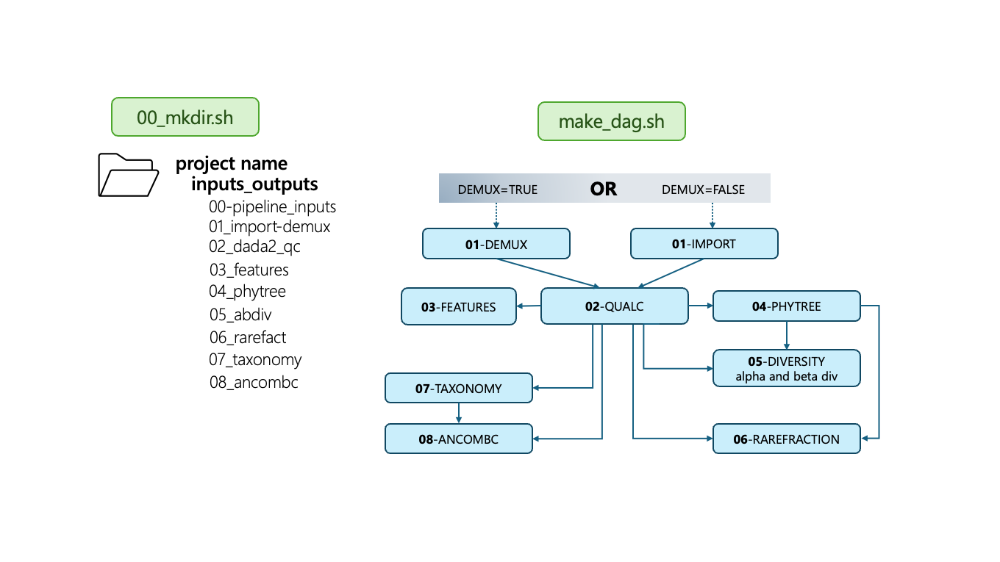

# 16S rRNA Amplicon Sequencing Pipeline [HTCondor + DAGman]

# Introduction to the pipeline
**Program:** This DAGman pipeline is based upon QIIME2 and documentation and utilizes a QIIME2 container. It is meant to be run within HTCondor using a DAGMan workflow manager. Please see citation below for the qiime2 citation.

**Purpose:** The purpose of this pipeline is to analyze short-read amplicon 16S rRNA sequencing data to characterize the microbiome of the samples. The workflow consists of 8 jobs that build upon one another, and generates outputs that are relevant to general microbiome questions (including but not limited to phylogenetic trees, diversity and taxonomic analyses, and differential abundance testing results). These processes are often time-consuming and complicated, and involve multiple dependencies. By working in HTCondor and DAGman, this pipeline allows researchers to streamline their data analysis in a reproducible and effective manner.
 
**Uses:** This pipeline can be used to assess bacterial communities and generate visualizations based off of their data. Due to its reproducibility, and modular nature, scripts can be modified as needed for custom analyses. It is highly recommended to consult the documentation listed in References below if one is interested in working with this version.

# Workflow

## Diagram with steps of pipeline


## Description of files in this repository:

* `README.md`: These directions
* `scripts/`: Contains all `.sh`/`.sub` files required for the pipeline.
  * `00_mkdir.sh`: Script to create directory in staging that will store outputs of jobs
  * `make_dag.sh`: DAGman configuration file
  * `00-08`: Executable and submit scripts pairs for HTCondor DAGman jobs
* `.gitignore`: all files to be ignored

# Step-by-step instructions

## Before starting

You will first need access to a `/staging/netid` folder. For more information about /staging folders, please visit: https://chtc.cs.wisc.edu/uw-research-computing/file-avail-largedata . The /staging folder will be used for the large genomic input files, and the large genomic output files.

In your request, please consider your input files (how many samples will you have, have the size of all your reads and assembled data, as well as your output files)

📂 **Input files needed**

**Demultiplied or not?**

1. You will need **paired-end reads** (Illumina) corresponding to the 16S rRNA gene amplicons.

**1.1. Already demultiplexed:**

 Most of the time, sequencing centers will give you this data already **demultiplexed**, meaning that you will get 2 files per samples, labelled like this: `{sample}_R1_001.fastq.gz` and `{sample}_R2_001.fastq.gz`. 

 Organize them like this:
 ```
 seqs/{sample}_R1_001.fastq.gz
 seqs/{sample}_R2_001.fastq.gz
 etc.
 ```

 
 **1.2 Not already demultiplexed**:

If the data is not already demultiplexed, you should find a forward reads fastq file, a reverse reads fastq file, and a file with barcodes associated with each sample. 

Organize your files like this:
```
seqs/
seqs/forward.fastq.gz
seqs/reverse.fastq.gz
seqs/barcodes.fastq.gz
```

If you just have fastq files, you can "zip" them into the gz file format by typing:
```
gzip forward.fastq
```


  
2. You will need a **tab-separated table** named exactly `sample_metadata.tsv`, (tsv = tab separated values). The file should contain information about the samples, such as sample characteristics. A TSV file is a text file that can be opened with any regular text editor or spreasheet program. The column names for the sample characteristics should not container any special characters, including dashes. For example, if you have a column named `transect-sites` rename it as `transectSite` (or something without dashes), and save the file again.

>[!NOTE]
>For your reference, [here](https://drive.google.com/drive/folders/1qCO_ztaghJvXEnkwRji8tGCH98csbijj?usp=sharing) is an example of what the input folder should look like.

## Steps

1. Log into CHTC
```
ssh netid@ap2002.chtc.wisc.edu
#enter your password
pwd
# this will say something like /home/netid
```
2. Clone this directory into your home directory and make all the script executable with the `chmod` command:
```
git clone https://github.com/UW-Madison-Bacteriology-Bioinformatics/16S_microbiome_wf.git
cd 16S_microbiome_wf
chmod +x scripts/*.sh
```
3. Create a logs folder in your cloned directory (path: `home/username/16S_microbiome_wf/scripts`) for your CHTC log, err and out files.
```
mkdir -p scripts/logs
```
 
4. Run the helper script `00_mkdir.sh` from your 16S_microbiome_wf/scripts directory. 
This will create the directory within your staging folder that is necessary to handle all file inputs and outputs. To run, type: ``` bash 00_mkdir.sh ```
The script takes 2 arguments: your netid, and the name of a folder that will be created. In this example, the folder will be named `test_project`
```
cd scripts
# change this for your netid
NETID=ptran5
PROJECT=my_project
bash 00_mkdir.sh $NETID $PROJECT
```

5. Run `make_dag.sh` from your scripts directory to create a DAG workflow. 
Be sure to include the four neccessary arguments for it to work. 

Help page:
```
make_dag.sh: illegal option -- h
HELP PAGE...


Syntax: bash make_dag.sh -d <TRUE|FALSE> -n <netid> -g <group> -p <project> -o <output filename>
These arguments can be provided in any order, but all arguments are required. Options are case-sensitive.

Options:
  -d    (required) Demux: Whether you need to demultiplex your data. Use TRUE if you want to demultiplex the data, and FALSE if you have already demultipldex data. Example: TRUE
  -n    (required) NetID: Your UW Madison netid. Example: bbadger
  -g    (required) Group: Group for the diversity plots, must be a column name in sample-metadata.tsv. Example: vegetation
  -p    (required) ProjectName: The project subfolder name. Example: test_project
  -o    (required) DAG output file name: Desired name for DAG file. Example: test_project

Example usage: bash make_dag.sh -d TRUE -n bbadger -g vegetation -p test_project -o test_project_true
Example usage: bash make_dag.sh -d FALSE -n bbadger -g vegetation -p test_project -o test_project_false
```

This will create a file named `test_project_true.dag` or `test_project_false.dag`

>[!NOTE]
> 07/15: For now, the group (`-g`) must be a categorical variable without any special characters. For example transect-name will not work because of the dash, but the group vegetation will. See Input Files above.
> This will be fixed in future iterations.
> For a temporary fix, you could also renamed your columns in your sample-metadata.tsv file such as there are no dashes (e.g transect-name would be TransectName) and use that as the group name when using `00_mkdir.sh`

6. Confirm that you have:
- A) the proper staging folder structure (path: `/staging/username/project/input_outputs/all job names 00-08`) 
- B) a DAG with your desired name in your scripts folder.

7. Import your input data (paired-end fastq files, and `sample-metadata.tsv` file) into your `/staging/username/project/input_outputs/00_pipeline_inputs` directory.

To transfer files from your laptop to CHTC you can do the following:
Open a new terminal window
From your laptop navigate to where the FASTQ files are located
```
cd Downloads
scp -r ~/Downloads/seqs netid@ap2002.chtc.wisc.edu:/staging/netid/project/input_ouputs/00_pipeline_inputs
```

Do the same thing to transfer the `sample-metadata.tsv` file to the sample folder:
```
scp -r ~/Downloads/sample-metadata.tsv netid@ap2002.chtc.wisc.edu:/staging/netid/project/input_ouputs/00_pipeline_inputs
```

The `scp` command takes two arguments. The first one (`~/Downloads/seqs`) is the folder you want to transfer over, and the second argument takes the form of the `sshaddress:path to where you want to put it`

>[!NOTE]
>For your reference, [here](https://drive.google.com/drive/folders/1qCO_ztaghJvXEnkwRji8tGCH98csbijj?usp=sharing) is an example of what the input  `00_pipeline_inputs` folder should look like.

8. Switch terminal windows and check that the files are transferred correctly.
```
ls /staging/netid/project/input_ouputs/00_pipeline_inputs/seqs
ls /staging/netid/project/input_outputs/00_pipeline_inputs/
```

you should be able to see all your paired FASTQ files - if not, try to troubleshoot the `scp` command or ask for help.

9. Navigate back to your `/home/username/16S_microbiome_wf/scripts` folder, and from there submit the dag.

```
cd ~/16S_microbiome_wf/scripts
condor_submit_dag test_project_dag.dag
```

10. Check your DAG's status with:
```
condor_q
```

At this point, you can log out of chtc, the job will still be running.
Just log back in later to see the job progress by typing condor_q again.

> [!TIP]
> If after typing `condor_q` you notice that one of your jobs went on hold, you can try to identify the reason by typing `condor_q -hold jobID`, where jobID is the number in the last column of the terminal printout for condor_q.
> Carefully read the message, and it might tell you that there was an issue during file transfer input or output. Common mistakes are incorrect file naming, in which case you will see something like "file not found". Carefully read that the path of the file it is trying to transfer is correct and exists.

11. The result for each job should appear within its respective output file within the `/staging/$NETID/$PROJECT/input_outputs` directory.

12. Transfer your files from CHTC to your computer once the job is correctly completed. One recommended way to do this is the following:

To do so, open a new Terminal window.

In terminal, navigate to the location you want the files to go on your device:
```
cd ~/Downloads
mkdir -p my_chtc_results
cd my_chtc_results
```

```
sftp netid@ap2002.cthc.wisc.edu
cd /staging/username/project/input_outputs
get -r *
exit
```

**Another** method to transfer the outputs files are:
```
# Make the output folders wherever you want:
cd ~/Downloads
mkdir -p my_chtc_results
cd my_chtc_results
# replace the netid and the file paths as appropriate, the ./ means transfer these files to the current directory, which would be my_chtc_results in this case 
scp -r bbadger@ap2002.chtc.wisc.edu:/staging/bbadger/project/input_outputs ./
```

# Next steps

The `.qza` (artefacts) and `qzv` (vizualisations) can be opened using the Qiime2 View website (https://view.qiime2.org/). 
From your laptop, where you downloaded your CHTC results files, drag and drop them onto the qiime2 View website to view the plots, tables, etc.
The `qza` files are actually zipped files, so you can also unzip them like a regular .zip file.

# ✨ Customizing the workflow

After you finish running the pipeline with the defaults, you will likely need to edit a few parameters to correctly process your dataset. Some of the main ones that can be changed are:

- Trimming lenghts on the forward and reverse reads (likely have to change depending on your data) (`scripts/02_dada2_qc.sh`)
- Depth of sequencing (likely have to change depending on your data) (`scripts/05_abdiv.sh`)
- Reference Taxonomic Database (`scripts/07_taxonomy.sh`)

## Asssessing what trimming lengths to use
`01-import-demux/demux.qzv` needs to be imported in qiime2 view. 
Click on the tab that says "Interactive quality plot". Check on the forward and reverse reads what position needs to be trimmed on the left and right-hand side of the forward and reverse reads. 

Go into the `scripts/02-dada2-qc.sh` script and manually (using nano) edit the file to change these 4 lines based on what you saw in the demux.qzv file:
```
  --p-trim-left-f newValue \
  --p-trim-left-r newValue \
  --p-trunc-len-f newValue \
  --p-trunc-len-r newValue \
```

## Sample Depth
Open the file `03_features/table.qzv` in Qiime2 View. 
Go to Interactive Sample Details and play around with the slider to see how increasing the Sequencing Depth decreases the number of seqs per samples.

Edit the line `--p-sampling-depth` of the script `05_abdiv.sh` according to what you see in output file 

## Changing the taxonomic database
`07-taxonomy/taxa-bar-plot.qzv` in qiime2 view: it doesn't look like much at first, but use the drop-down menu to select another taxonomic level (level 1 = kingdom, 2 = phylum, 3=class, 4=order, 5=family, 6=genus), different color palettes, samples, etc. You can even change the color paletter.

Currently, the `07_taxonomy.sh` script uses the GreenGenes database. Other common ones are Silva.
If you want to use the Silva Database instead, modify the `wget` command of script `07_taxonomy.sh` to:

Before (using greengenes, default)
```
wget -O 'gg-13-8-99-515-806-nb-classifier.qza' \
  'https://moving-pictures-tutorial.readthedocs.io/en/latest/data/moving-pictures/gg-13-8-99-515-806-nb-classifier.qza'

```

After (using Silva):
```
Information to come.
```

## Resubmit the DAG
Once you have modified these values for something customized to your study, rerun the dag, by making a copy of your dag workflow first (e.g. `test_project_dag.dag`)
```
# in the chtc terminal:
cp test_project_dag.dag test_project_dag_2.dag
condor_submit_dag test_project_dag_2.dag
```

Wait for the job to complete, and take a look at the output files again, now that the workflow is using the proper trimming parameters that are specific to your dataset.

## Special Considerations
* Do not include any personal information in the data input into the pipeline.
* Please set up a staging folder with CHTC before trying this pipeline. It is meant to process large amounts of data that your home directory may not neccessarily be able to manage.

# References
If you find this pipeline helpful, please cite this GitHub Repository:
1. Tran, P. Q., Michaelis, M. L. (2025). 16S rRNA-seq (Version 0.1) ([link](https://github.com/UW-Madison-Bacteriology-Bioinformatics/16S_microbiome_wf.git))

This workflow relies on the following softwares, please cite them as well:
 
1. QIIME2: Bolyen, E., Rideout, J. R., Dillon, M. R., Bokulich, N. A., Abnet, C. C., Al-Ghalith, G. A., ... & Caporaso, J. G. (2019). Reproducible, interactive, scalable and extensible microbiome data science using QIIME 2. Nature Biotechnology, 37(8), 852–857. https://doi.org/10.1038/s41587-019-0209-9
2. DADA2: Callahan, B. J., McMurdie, P. J., Rosen, M. J., Han, A. W., Johnson, A. J. A., & Holmes, S. P. (2016). DADA2: High-resolution sample inference from Illumina amplicon data. Nature Methods, 13(7), 581–583. https://doi.org/10.1038/nmeth.3869
3. MAFFT: Katoh, K., & Standley, D. M. (2013). MAFFT multiple sequence alignment software version 7: Improvements in performance and usability. Molecular Biology and Evolution, 30(4), 772–780. https://doi.org/10.1093/molbev/mst010
4. FastTree: Price, M. N., Dehal, P. S., & Arkin, A. P. (2010). FastTree 2 – approximately maximum-likelihood trees for large alignments. PLoS ONE, 5(3), e9490. https://doi.org/10.1371/journal.pone.0009490
5. Emperor: Vázquez-Baeza, Y., Pirrung, M., Gonzalez, A., & Knight, R. (2013). EMPeror: A tool for visualizing high-throughput microbial community data. GigaScience, 2(1), 16. https://doi.org/10.1186/2047-217X-2-16
6. ANCOM-BC: Lin, H., Peddada, S. D. (2020). Analysis of compositions of microbiomes with bias correction. Nature Communications, 11, 3514. https://doi.org/10.1038/s41467-020-17303-4
7. GreenGenes Taxonomic Database: DeSantis TZ, Hugenholtz P, Larsen N, Rojas M, Brodie EL, Keller K, Huber T, Dalevi D, Hu P, Andersen GL2006.Greengenes, a Chimera-Checked 16S rRNA Gene Database and Workbench Compatible with ARB. Appl Environ Microbiol72:.https://doi.org/10.1128/AEM.03006-05

# Help and additional information:
Patricia Q. Tran, ptran5@wisc.edu, University of Wisconsin-Madison Get Help:
- For people at UW-Madison, please visit the [departmental bioinformatics research support service main website](https://bioinformatics.bact.wisc.edu/). If you are part of the Department of Bacteriology please make an 1-on-1 individual appointment, others please attend one of my weekly office hours.
- For external people, please submit an issue via the github page.
